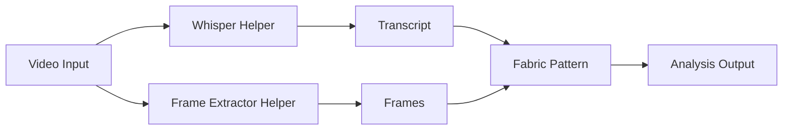

# Project Requirements Plan: Screenscribe as Fabric Extension

**Version:** 2.0  
**Date:** December 2024  
**Author:** Senior Developer  
**Status:** Draft  
**Approach:** Wrapper/Extension Model

## Executive Summary

This revised PRP proposes implementing Screenscribe's functionality as extensions to Fabric rather than a full migration. This approach adds video processing capabilities to Fabric through helper tools and patterns, maintaining simplicity while leveraging Fabric's existing infrastructure.

## Simplified Architecture



## Implementation Components

### 1. Whisper Transcription Helper Tool

Create `cmd/whisper_transcribe/` similar to existing Fabric helpers:

```go
// cmd/whisper_transcribe/main.go
package main

import (
    "encoding/json"
    "fmt"
    "os"
    "os/exec"
)

type TranscriptOutput struct {
    Text      string            `json:"text"`
    Segments  []TranscriptSegment `json:"segments"`
    Duration  float64           `json:"duration"`
}

func main() {
    // 1. Accept video file path
    // 2. Use whisper CLI or Python script for transcription
    // 3. Output JSON to stdout for piping to Fabric
}
```

**Installation:**
```bash
go install github.com/danielmiessler/fabric/cmd/whisper_transcribe@latest
```

**Usage:**
```bash
whisper_transcribe video.mp4 | fabric -p analyze_video
```

### 2. Frame Extraction Helper Tool

Create `cmd/video_frames/`:

```go
// cmd/video_frames/main.go
package main

func main() {
    // 1. Accept video file path
    // 2. Extract frames at intervals using ffmpeg
    // 3. Convert frames to base64 or save paths
    // 4. Output frame data as JSON
}
```

**Usage:**
```bash
video_frames video.mp4 --interval 30s | fabric -p analyze_frames
```

### 3. Combined Video Analysis Helper

Create `cmd/video_analyze/` that orchestrates both:

```go
// cmd/video_analyze/main.go
package main

type VideoAnalysisInput struct {
    Transcript TranscriptOutput `json:"transcript"`
    Frames     []FrameData     `json:"frames"`
    Metadata   VideoMetadata   `json:"metadata"`
}

func main() {
    // 1. Run whisper_transcribe
    // 2. Run video_frames
    // 3. Combine outputs
    // 4. Format for Fabric pattern consumption
}
```

**Usage:**
```bash
video_analyze tutorial.mp4 | fabric -p analyze_video_content
```

### 4. Fabric Patterns for Video Analysis

Create specialized patterns in `data/patterns/`:

#### Pattern: `analyze_video_content`
```markdown
# IDENTITY and PURPOSE

You are an expert at analyzing video content by combining transcript and visual frame information to create comprehensive summaries.

# STEPS

- Review the transcript to understand the spoken content
- Analyze frame descriptions to identify visual elements
- Correlate visual and audio information
- Extract key teaching points, demonstrations, or messages
- Note timestamps for important moments

# INPUT FORMAT

You will receive a JSON object with:
- transcript: Object containing text and timed segments
- frames: Array of frame descriptions with timestamps
- metadata: Video duration, title, etc.

# OUTPUT INSTRUCTIONS

- Create a SUMMARY section with 50-word overview
- Create a KEY_POINTS section with main takeaways
- Create a VISUAL_HIGHLIGHTS section for important visuals
- Create a TIMELINE section with timestamps and descriptions
- Create an ACTION_ITEMS section with next steps

# INPUT

INPUT:
```

#### Pattern: `extract_code_from_video`
```markdown
# IDENTITY and PURPOSE

You are an expert at extracting code snippets and technical content from video tutorials.

# STEPS

- Identify all code shown in frames
- Match code visuals with explanations in transcript
- Reconstruct complete code examples
- Add context from verbal explanations

# OUTPUT INSTRUCTIONS

- Create CODE_SNIPPETS section with extracted code
- Include timestamps and explanations
- Format code with proper syntax highlighting
- Add setup instructions if mentioned

# INPUT

INPUT:
```

### 5. Trading-Specific Patterns

Create specialized patterns for financial/trading content:

#### Pattern: `analyze_trading_video`
```markdown
# IDENTITY and PURPOSE

You are an expert trading educator and market analyst. You excel at extracting actionable trading insights from educational videos, identifying key technical analysis concepts, and understanding market structure discussions.

# STEPS

- Identify all chart patterns and price action discussed
- Extract technical indicator settings and interpretations  
- Note support/resistance levels and key market structure
- Capture specific trade setups with entry/exit criteria
- Document risk management principles mentioned
- Correlate visual charts with verbal explanations

# INPUT FORMAT

You will receive a JSON object with:
- transcript: Trading discussion and market analysis
- frames: Chart screenshots and trading diagrams
- metadata: Video duration and timestamps

# OUTPUT INSTRUCTIONS

- Create a MARKET_ANALYSIS section with current market conditions discussed
- Create a TECHNICAL_SETUPS section with specific trade configurations
- Create a KEY_LEVELS section with support/resistance prices
- Create a RISK_MANAGEMENT section with position sizing and stop loss guidance
- Create a TRADING_INSIGHTS section with actionable takeaways
- Include specific price levels, percentages, and timeframes

# INPUT

INPUT:
```

#### Pattern: `extract_technical_analysis`
```markdown
# IDENTITY and PURPOSE

You are a technical analysis expert specializing in chart pattern recognition and indicator analysis from trading videos.

# STEPS

- Identify all technical indicators shown (MA, RSI, MACD, etc.)
- Extract specific indicator settings and parameters
- Note chart patterns (triangles, flags, head-and-shoulders)
- Capture trend lines and their significance
- Document volume analysis and market structure
- Extract backtesting results if shown

# OUTPUT INSTRUCTIONS

- Create an INDICATORS section with settings and signals
- Create a CHART_PATTERNS section with identified formations
- Create a TREND_ANALYSIS section with directional bias
- Create a VOLUME_PROFILE section if applicable
- Include specific values, not generalizations

# INPUT

INPUT:
```

#### Pattern: `extract_trading_strategy`
```markdown
# IDENTITY and PURPOSE

You are a systematic trading expert who extracts complete trading strategies from educational content.

# STEPS

- Identify the complete trading strategy being taught
- Extract entry conditions and triggers
- Note exit rules and profit targets
- Capture risk management rules
- Document market conditions for the strategy
- Note any backtesting or performance metrics

# OUTPUT INSTRUCTIONS

- Create a STRATEGY_NAME section
- Create an ENTRY_RULES section with specific conditions
- Create an EXIT_RULES section with targets and stops
- Create a RISK_PARAMETERS section with position sizing
- Create a MARKET_CONDITIONS section for when to use/avoid
- Create a PERFORMANCE_METRICS section if data provided
- Format as actionable trading plan

# INPUT

INPUT:
```

#### Pattern: `analyze_market_commentary`
```markdown
# IDENTITY and PURPOSE

You are a market analyst who extracts key insights from trading commentary and market analysis videos.

# STEPS

- Identify market outlook and directional bias
- Extract specific price targets and levels
- Note timeframes for predictions
- Capture reasoning behind analysis
- Document any contrarian views
- Extract sector or asset-specific insights

# OUTPUT INSTRUCTIONS

- Create a MARKET_OUTLOOK section with bias and timeframe
- Create a PRICE_TARGETS section with specific levels
- Create a KEY_CATALYSTS section with market drivers
- Create a RISKS section with potential invalidation points
- Create an ACTIONABLE_TRADES section if mentioned
- Be specific with numbers, dates, and reasoning

# INPUT

INPUT:
```

### 6. Trading Workflow Examples

```bash
# Analyze a trading tutorial
video_analyze trading_tutorial.mp4 | fabric -p analyze_trading_video

# Extract complete strategy
video_analyze strategy_video.mp4 | fabric -p extract_trading_strategy > strategy.md

# Technical analysis focus
video_analyze chart_analysis.mp4 | \
  fabric -p extract_technical_analysis | \
  fabric -p create_tradingview_script

# Market commentary processing
video_analyze market_update.mp4 | \
  fabric -p analyze_market_commentary | \
  fabric -p generate_trade_ideas

# Chain for complete trading education
video_analyze webinar.mp4 | \
  fabric -p analyze_trading_video | \
  fabric -p extract_actionable_trades | \
  fabric -p format_trade_journal
```

### 7. Integration with Trading Tools

Future patterns could integrate with:
- TradingView pine script generation
- Risk calculator inputs
- Trade journal formatting
- Backtesting frameworks
- Alert creation

## Implementation Plan

### Phase 1: Core Helper Tools (Week 1)

1. **Whisper Transcription Helper**
   ```python
   # scripts/whisper_wrapper.py
   import whisper
   import json
   import sys
   
   def transcribe_video(video_path, model="base"):
       model = whisper.load_model(model)
       result = model.transcribe(video_path)
       
       output = {
           "text": result["text"],
           "segments": result["segments"],
           "language": result["language"]
       }
       
       print(json.dumps(output))
   ```

2. **Frame Extraction Helper**
   ```bash
   #!/bin/bash
   # scripts/extract_frames.sh
   
   VIDEO=$1
   INTERVAL=${2:-30}
   OUTPUT_DIR=$(mktemp -d)
   
   ffmpeg -i "$VIDEO" -vf "fps=1/$INTERVAL" "$OUTPUT_DIR/frame_%04d.jpg"
   
   # Convert frames to base64 and output JSON
   ```

### Phase 2: Integration Layer (Week 1-2)

1. **Combined Analysis Tool**
   ```go
   // Combines transcript + frames into single JSON
   // Handles different video formats
   // Manages temporary files
   // Provides progress feedback
   ```

2. **Fabric Pattern Integration**
   - Create patterns for different video types
   - Test with existing Fabric infrastructure
   - Ensure compatibility with pipe operations

### Phase 3: Enhanced Features (Week 2)

1. **Multi-Backend Support**
   - Integrate MLX for Apple Silicon
   - Add faster-whisper option
   - Auto-detect best backend

2. **Streaming Support**
   - YouTube URL handling
   - Network file optimization
   - Progress indicators

## Usage Examples

### Basic Video Analysis
```bash
# Simple analysis
video_analyze tutorial.mp4 | fabric -p analyze_video_content

# With specific model
video_analyze lecture.mp4 --whisper-model large | fabric -p summarize_lecture

# Extract code from tutorial
video_analyze coding_tutorial.mp4 | fabric -p extract_code_from_video
```

### Advanced Workflows
```bash
# Chain multiple patterns
video_analyze presentation.mp4 | \
  fabric -p analyze_video_content | \
  fabric -p extract_key_points | \
  fabric -p create_blog_post

# Save intermediate results
video_analyze workshop.mp4 > workshop_data.json
cat workshop_data.json | fabric -p analyze_video_content > summary.md
cat workshop_data.json | fabric -p extract_action_items > todos.md
```

### Integration with Existing Fabric Features
```bash
# Use with web search for context
video_analyze news_segment.mp4 | \
  fabric -p extract_main_topics | \
  fabric -p research_topics --search

# Generate illustrations from video content
video_analyze art_tutorial.mp4 | \
  fabric -p extract_visual_descriptions | \
  fabric -p generate_images --image-file outputs/
```

## Advantages of Wrapper Approach

1. **Minimal Changes to Fabric Core**
   - No need to modify Fabric's Go codebase extensively
   - Leverages existing pattern system
   - Uses established helper tool pattern

2. **Maintains Screenscribe Performance**
   - Keep Python/ML optimizations
   - Use best-in-class transcription libraries
   - Platform-specific acceleration (MLX)

3. **Flexible Integration**
   - Users can use individual components
   - Easy to update/upgrade components
   - Works with Fabric's existing workflow

4. **Simpler Implementation**
   - 2-week implementation vs 4-week migration
   - Less risk of breaking changes
   - Easier to maintain

## Technical Requirements

### Dependencies
- Python 3.9+ (for whisper/MLX)
- FFmpeg (for video processing)
- Go 1.19+ (for helper tools)
- Existing Fabric installation

### Configuration
```bash
# ~/.config/fabric/.env additions
VIDEO_WHISPER_MODEL=base
VIDEO_FRAME_INTERVAL=30
VIDEO_WHISPER_BACKEND=auto
```

## Success Metrics

1. **Functionality**: All Screenscribe features available through Fabric
2. **Performance**: Maintain current transcription speeds
3. **Usability**: Simple command-line interface
4. **Integration**: Seamless piping with Fabric patterns
5. **Adoption**: Easy installation and setup

## Next Steps

1. **Prototype whisper_transcribe helper** - Test basic functionality
2. **Create frame extraction tool** - Validate ffmpeg approach
3. **Develop first video analysis pattern** - Prove concept
4. **Test end-to-end workflow** - Ensure smooth integration
5. **Document installation process** - Make it user-friendly

## Conclusion

This wrapper approach provides Screenscribe's capabilities to Fabric users without the complexity of a full migration. By creating focused helper tools and leveraging Fabric's pattern system, we achieve the goal of video analysis within the Fabric ecosystem while maintaining simplicity and performance. 